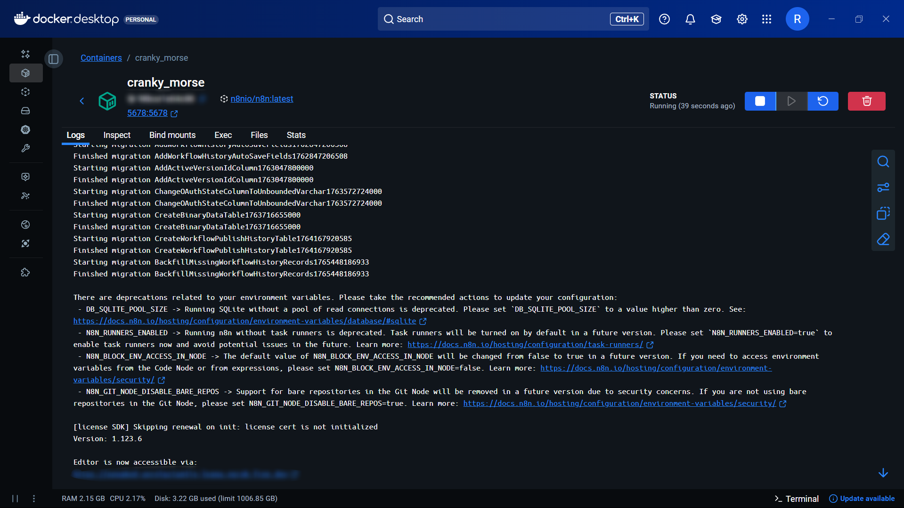
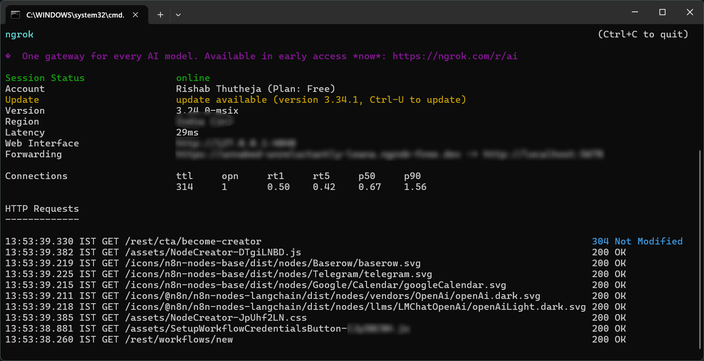
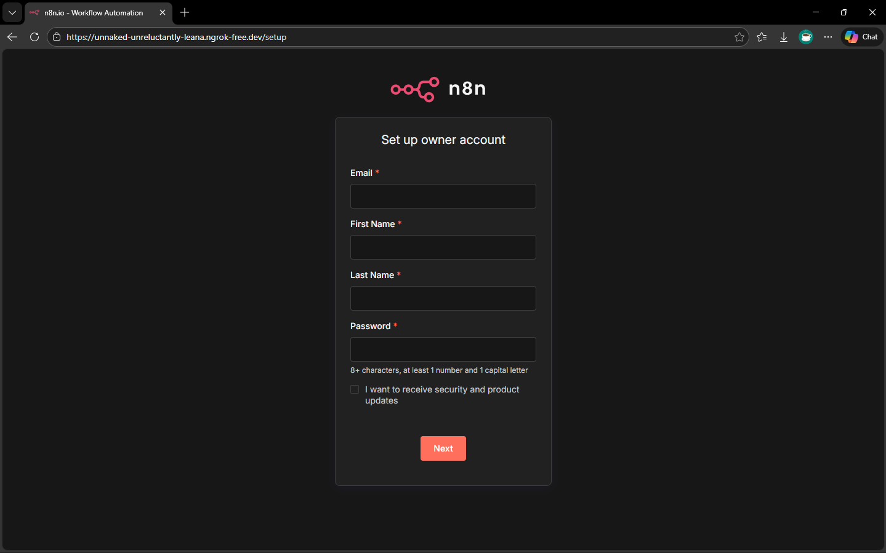
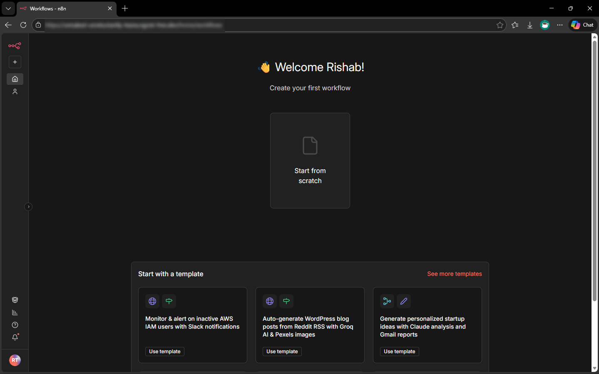
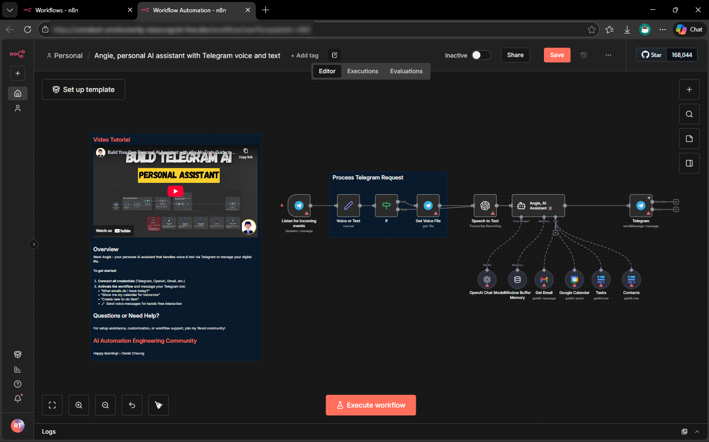

# 🚀 Self-Hosted n8n Automation Server with Remote Access

This project demonstrates the deployment of a **self-hosted n8n automation platform** using **Docker**, with secure remote access enabled via **ngrok**. The setup allows workflows and AI-driven automation pipelines to be accessed from anywhere while the local server is running.

---

## 📌 Overview

* Deployed n8n locally using Docker containers
* Persisted workflow data using Docker volume mapping
* Exposed the local n8n server to the public internet using ngrok
* Enabled webhook and editor access for remote workflow execution
* Designed the setup to support **AI agent–based automation workflows**

---

## 🛠️ Tech Stack

* **Automation Platform:** n8n
* **Containerization:** Docker Desktop
* **Networking / Tunneling:** ngrok
* **Operating System:** Windows
* **Data Persistence:** Docker volume (filesystem mode)

---

## ⚙️ Setup Steps

### 1. ngrok Configuration

* Created an ngrok account and accessed the dashboard
* Downloaded ngrok for Windows
* Authenticated ngrok locally using:

```bash
ngrok config add-authtoken <YOUR_NGROK_AUTH_TOKEN>
```

---

### 2. Docker Setup

* Installed Docker Desktop
* Pulled the official n8n Docker image from Docker Hub
* Created a local directory to persist n8n workflow data

---

### 3. Running n8n Container

* Ran the n8n Docker image with:

  * Host port mapped to container port `5678`
  * Volume mapping for persistent data storage
  * Environment variables configured for external access

---

### 4. Environment Variables Used

| Variable                                  | Purpose                                                  |
| ----------------------------------------- | -------------------------------------------------------- |
| `N8N_COMMUNITY_PACKAGES_ALLOW_TOOL_USAGE` | Enables advanced community node functionality            |
| `N8N_EDITOR_BASE_URL`                     | Sets the public-facing URL for the n8n editor            |
| `WEBHOOK_URL`                             | Ensures webhooks work correctly when accessed externally |
| `N8N_DEFAULT_BINARY_DATA_MODE`            | Stores binary data on filesystem instead of memory       |

---

### 5. ngrok Tunnel

* Started an HTTP tunnel to expose the local n8n service:

```bash
ngrok http 5678
```

* Used the generated public ngrok URL to access n8n remotely

---

## 🌍 Result

* n8n editor accessible from any device using the ngrok URL
* Workflows remain persistent across container restarts
* Webhooks and triggers function correctly over the public endpoint
* Suitable foundation for **AI agent orchestration and automation pipelines**

---

## 📷 Screenshots

### n8n Running in Docker Container


### Public Access via ngrok Tunnel


### n8n Editor Interface




---

## 🔮 Future Improvements

* Add Docker Compose configuration
* Secure access using ngrok authentication
* Integrate LLM-based AI agents into n8n workflows
* Deploy on a cloud VM for 24/7 availability

---

## 📎 Notes

This project focuses on **infrastructure deployment and automation**, not application-level coding, and reflects real-world practices used in AI workflow orchestration.